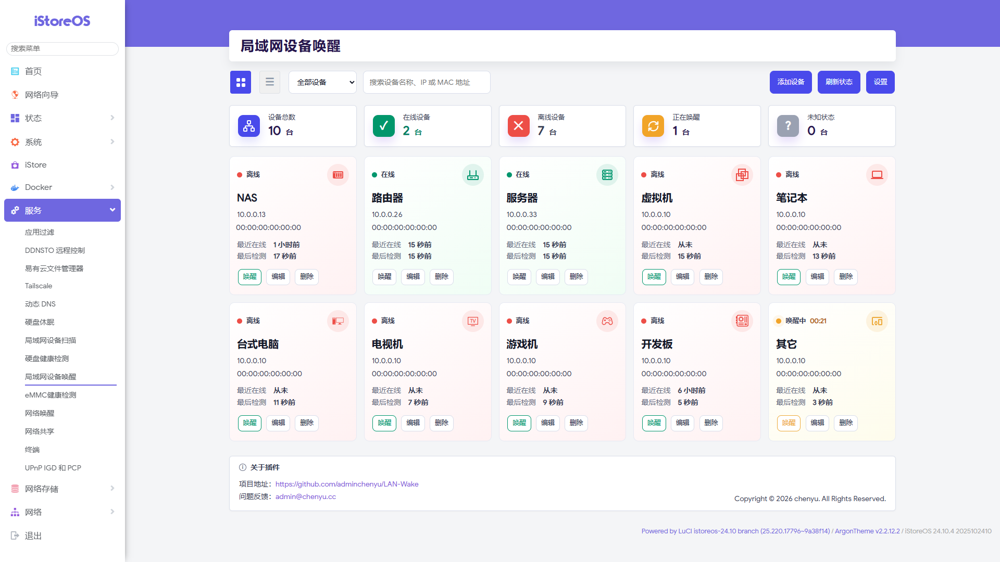

<p align="center">
  
</p>

<h1 align="center">局域网设备唤醒</h1>

<p align="center">
  <strong>Wake-on-LAN for iStoreOS / OpenWrt</strong>
</p>

<p align="center">
  
  
  
  
</p>

---

## 项目简介

**局域网设备唤醒** 是一个适用于 **iStoreOS / OpenWrt** 的现代化 LuCI Wake-on-LAN 插件。

它用于图形化管理局域网内的 NAS、软路由、服务器、台式电脑、笔记本、迷你主机等设备，支持设备卡片、在线检测、状态展示和一键唤醒，让 Wake-on-LAN 的使用更加直观、方便。

插件使用原生 OpenWrt / LuCI 架构实现：

- 配置存储：UCI
- 后端接口：rpcd / ubus
- 前端界面：LuCI JavaScript View
- 无需 Vue / React / Svelte
- 不依赖 Node.js
- 不依赖外部数据库

---

## 界面预览



---

## 功能特性

### 设备管理

- 添加、编辑、删除设备
- 启用 / 禁用设备
- 支持设备类型图标
- 支持设备卡片视图
- 支持列表视图
- 支持搜索设备名称、IP、MAC 地址
- 支持按设备状态筛选

### 状态检测

支持多种设备状态：

| 状态 | 说明 |
|---|---|
| 🟢 在线 | 设备当前可访问 |
| ⚪ 未知 | 最近在线过，但当前检测失败 |
| 🔴 离线 | 长时间无响应 |
| 🟡 唤醒中 | 已发送 WOL 指令，等待设备启动 |
| ⚫ 未检测 | 新设备或尚未检测 |

### Wake-on-LAN 唤醒

- 支持一键发送 Magic Packet
- 支持自定义广播地址
- 支持自定义 WOL 端口
- 支持默认网络接口配置
- 自动检测 `wakeonlan` / `etherwake`
- 唤醒后自动进入“唤醒中”状态
- 唤醒后自动轮询检测设备是否上线

### 界面体验

- 现代化卡片式界面
- 适配 iStoreOS / ArgonTheme 风格
- 支持移动端自适应
- 支持浅色 / 暗色主题兼容
- 状态底色区分设备状态
- 设备图标水印显示
- 操作按钮清晰直观

---

## 安装方法

将编译得到的 `.ipk` 文件上传到路由器，然后执行：

```sh
opkg update
opkg install luci-app-lan-wake_1.1.1-1_all.ipk
```

安装完成后，在 LuCI 中进入：

```text
服务 → 局域网设备唤醒
```

LuCI 入口路径：

```text
/cgi-bin/luci/admin/services/lan-wake
```

---

## 编译方法

在 OpenWrt / iStoreOS SDK 中编译：

```sh
cd openwrt
cp -r /path/to/luci-app-lan-wake package/luci-app-lan-wake
make menuconfig
make package/luci-app-lan-wake/compile V=s
```

菜单位置：

```text
LuCI → 3. Applications → luci-app-lan-wake
```

---

## 依赖说明

基础依赖：

- `luci-base`
- `luci-js-deps`
- `rpcd`

唤醒工具：

- `wakeonlan`
- `etherwake`

插件会自动检测系统中可用的唤醒工具：

1. 优先使用 `wakeonlan`
2. 如果不存在，则尝试使用 `etherwake`
3. 如果都不存在，页面会提示安装相关依赖

---

## 使用说明

1. 打开 LuCI 后进入 **服务 → 局域网设备唤醒**。
2. 点击 **添加设备**。
3. 填写设备名称、MAC 地址、IP 地址、广播地址。
4. 根据需要选择设备类型、启用状态和检测参数。
5. 保存后，点击设备卡片上的 **唤醒** 按钮。
6. 插件会发送 WOL 魔术包，并自动检测设备是否上线。

---

## WOL 使用前提

Wake-on-LAN 需要目标设备和网络环境同时满足以下条件：

- 目标设备支持 Wake-on-LAN
- 主板 BIOS / UEFI 已开启 WOL
- 网卡支持 Magic Packet 唤醒
- 关机后网卡仍保持待机供电
- 路由器与目标设备处于同一局域网，或广播包可达
- MAC 地址填写正确
- 广播地址填写正确，例如：

```text
192.168.1.255
10.0.0.255
```

---

## BIOS / UEFI 设置提示

不同主板中的名称可能不同，常见选项包括：

- Wake on LAN
- Power On By PCI-E
- Resume By LAN
- PME Event Wake Up
- Wake Up By Onboard LAN

如果有以下选项，通常需要关闭：

- ErP Ready
- Deep Sleep
- Energy Efficient Ethernet

否则关机后网卡可能会断电，导致无法唤醒。

---

## 网卡设置提示

### Linux

可使用 `ethtool` 查看和开启 WOL：

```sh
ethtool eth0
ethtool -s eth0 wol g
```

### Windows

在设备管理器中找到网卡，检查：

- 允许此设备唤醒计算机
- 只允许幻数据包唤醒计算机
- Wake on Magic Packet
- 关机网络唤醒

---

## 常见问题

### 点击唤醒后设备没有反应

请检查：

- MAC 地址是否正确
- 广播地址是否正确
- 目标设备是否支持 WOL
- BIOS / UEFI 是否开启 WOL
- 网卡是否开启 Magic Packet 唤醒
- 路由器是否已安装 `wakeonlan` 或 `etherwake`
- 交换机或路由器是否阻止广播包

### 设备一直显示未知

“未知”表示设备最近在线过，但当前检测失败。可能原因包括：

- 设备临时休眠
- 设备防火墙禁止 ICMP
- IP 地址变化
- Ping 被阻止
- 网络暂时不可达

### 页面提示 Object not found

表示 `rpcd` 尚未加载 `lan-wake` 后端对象。可执行：

```sh
chmod 755 /usr/libexec/rpcd/lan-wake
rm -f /tmp/luci-indexcache
/etc/init.d/rpcd restart
```

然后刷新 LuCI 页面。

---

## 后端接口

rpcd / ubus 对象名：

```text
lan-wake
```

接口包括：

- `list_devices`
- `get_device`
- `add_device`
- `update_device`
- `delete_device`
- `wake_device`
- `check_status`
- `check_all_status`
- `get_dependencies`
- `get_settings`
- `update_settings`

返回格式示例：

```json
{
  "success": true,
  "message": "操作成功",
  "data": {}
}
```

---

## 项目信息

- 项目地址：<https://github.com/adminchenyu/LAN-Wake>
- 问题反馈：<admin@chenyu.cc>
- 中文名称：局域网设备唤醒
- 英文名称：Wake-on-LAN
- LuCI 包名：`luci-app-lan-wake`
- UCI 配置：`/etc/config/lan_wake`

---

## 版权

Copyright © 2026 chenyu. All Rights Reserved.
